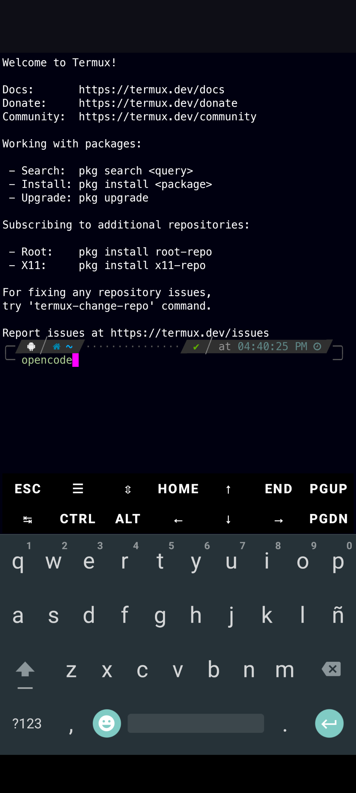
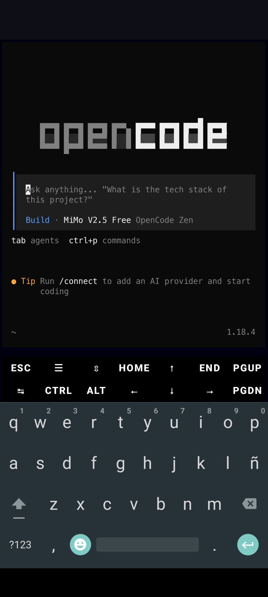
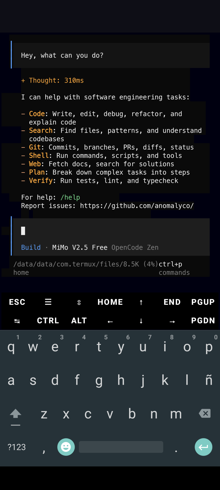
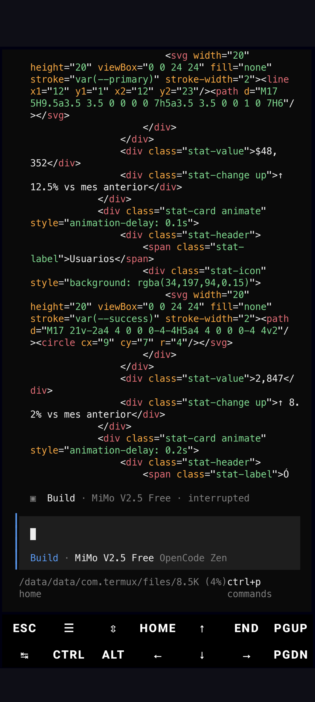

<p align="center">
  <a href="https://opencode.ai">
    
  </a>
</p>

<h1 align="center">opencode-termux</h1>

<p align="center">
  
  
  
</p>

<p align="center">
  <b>OpenCode AI assistant compiled for Android Termux (aarch64)</b><br>
  <sub>With verified automatic updates for Termux ARM64</sub>
</p>

<p align="center">
  
</p>
<p align="center">
  
</p>
<p align="center">
  
</p>
<p align="center">
  
</p>

---

## 🚀 Installation

```bash
npm install -g opencode-termux
```

Once installed, simply run:

```bash
opencode
```

> **That's it!** The wrapper handles everything: downloads the binary, sets up musl libraries, and launches OpenCode.

---

## ✨ Features

| Feature | Description |
|---------|-------------|
| 🔧 **Auto-setup** | First run downloads and configures everything automatically |
| 🔄 **Auto-update** | Checks npm for a newer verified package without deleting a working install on failure |
| 🛡️ **Official updates disabled** | Prevents the official binary from breaking Termux compatibility |
| 🔐 **Integrity check** | Verifies the release archive SHA-256 recorded in the npm package |
| 📦 **No root required** | Works completely without root permissions |
| ⚡ **Fast** | Updates are silent and don't interrupt your workflow |

---

## 📁 Project Structure

```
opencode-termux/
├── .github/
│   └── workflows/
│       └── auto-update.yml    # GitHub Action: auto-publishes new versions
├── bin/
│   └── opencode              # Bash wrapper: auto-update + launches binary
├── .gitignore                # Git ignore rules
├── .npmignore                # npm ignore rules
├── install.js                # Verified installer: downloads, validates and patches the binary
├── release-checksums.json    # SHA-256 for the matching GitHub release archive
├── scripts/build-android-release.sh # Reproducibly packages ARM64 musl runtime for Termux
├── LICENSE                   # MIT license
├── opencode-logo.svg         # OpenCode logo
├── package.json              # npm config (version = opencode version)
└── README.md
```

---

## 🔍 How It Works

### Flow Diagram

```
                          ┌──────────┐
                          │ opencode │
                          └────┬─────┘
                               │
                               ▼
                   ┌───────────────────────┐
                   │ ~/.opencode is complete │
                   └───────────┬───────────┘
                               │
                 ┌─────────────┴─────────────┐
                 │                           │
                YES                         NO
                 │                           │
                 ▼                           ▼
      ┌──────────────────┐        ┌──────────────────┐
      │  Check npm for   │        │    install.js    │
      │  latest version  │        │  Downloads from  │
      └────────┬─────────┘        │  GitHub Releases │
               │                  └────────┬─────────┘
       ┌───────┴───────┐                   │
       │               │                   ▼
     SAME          NEWER                 exec
       │               │
       ▼               ▼
      exec     ┌────────────────┐
               │  npm install   │
               │  rm old binary │
               │  install.js    │
               └───────┬────────┘
                       │
                       ▼
                     exec
```

### 1️⃣ First Run

When you run `opencode` for the first time:

1. **`bin/opencode`** resolves symlinks to find the real package path
2. Detects whether `~/.opencode/` has the binary and every required runtime library
3. Runs **`install.js`** which:
   - Downloads `opencode-termux-aarch64.tar.gz` from [GitHub Releases](https://github.com/C04-wq/opencode-termux/releases)
   - Verifies the archive SHA-256 from the npm package
   - Extracts the binary and runtime libraries to `~/.opencode/`
   - Runs `patchelf` to configure the musl interpreter
   - Verifies the staged binary before replacing the local runtime
4. Launches the binary with the required environment variables

### 2️⃣ Subsequent Runs

```
bin/opencode
  → ~/.opencode/opencode and runtime libraries exist ✓
  → Local version == npm version ✓
  → exec ~/.opencode/opencode (no changes)
```

### 3️⃣ When a New Version Is Available

**GitHub Action** (every 6 hours):
```
1. Detects new official opencode version
2. Downloads OpenCode's official ARM64 musl build
3. Packages it with ARM64 musl, libgcc and libstdc++ runtime libraries from Alpine
4. Publishes to npm (opencode-termux@vNewVersion)
5. Creates release on GitHub
6. Git commit + push
```

**On your phone** (next run):
```
bin/opencode
  → CURRENT=1.18.4 ≠ LATEST=1.18.5
  → "Installing update v1.18.5..."
  → npm install -g opencode-termux@latest
  → rm old binary
  → install.js downloads new binary
  → exec v1.18.5
```

---

## ⚙️ Environment Variables

| Variable | Value | Purpose |
|----------|-------|---------|
| `OPENCODE_DISABLE_AUTOUPDATE` | `1` | Disables official opencode updates |
| `LD_PRELOAD` | `~/.opencode/ld-musl-aarch64.so.1` | Loads the musl runtime |
| `LD_LIBRARY_PATH` | `~/.opencode/` | Path to shared libraries |
| `SSL_CERT_FILE` | `/data/data/com.termux/files/usr/etc/tls/cert.pem` | Termux SSL certificates |

---

## 📋 Requirements

- **OS**: Android with [Termux](https://f-droid.org/en/packages/com.termux/)
- **Architecture**: ARM64 (aarch64)
- **Connection**: Internet (for installation and updates)
- **Node.js**: Installed in Termux (`pkg install nodejs`)
- **npm**: Included with Node.js

---

## 🛠️ Troubleshooting

### Binary not downloading

```bash
# Verify connection works
curl -s https://github.com | head -1

# Reinstall manually from the installed npm package
npm install -g opencode-termux@latest --force
rm -f ~/.opencode/opencode
opencode
```

### patchelf error

```bash
# Install patchelf
pkg install patchelf

# Re-run
opencode
```

### Update failing

```bash
# Force a clean runtime reinstall
rm -f ~/.opencode/opencode
opencode
```

---

## 🔄 Manual Update

```bash
# Check current version
npm view opencode-termux version

# Force update
npm install -g opencode-termux@latest --force
rm -f ~/.opencode/opencode
opencode
```


---

## 🗑️ Uninstall

```bash
# Remove global npm package
npm uninstall -g opencode-termux

# Remove all opencode files
rm -rf ~/.opencode ~/opencode-termux ~/.config/opencode
```

---

## 📄 License

[MIT](LICENSE)

---

<p align="center">
  <sub>Made with ❤️ for the Termux community</sub>
</p>
